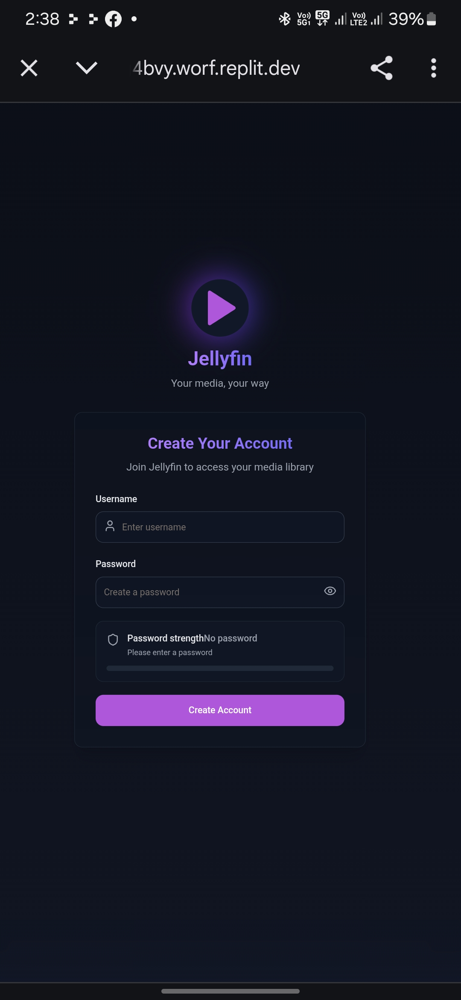
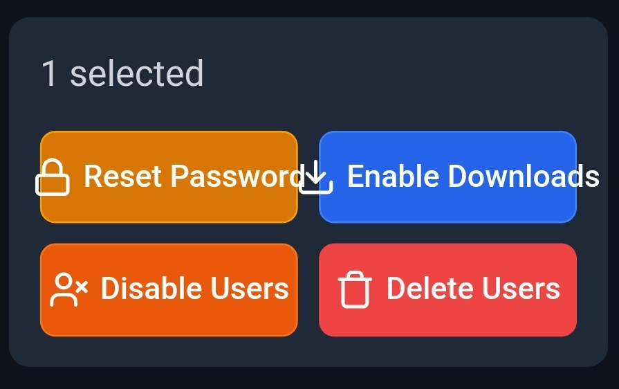
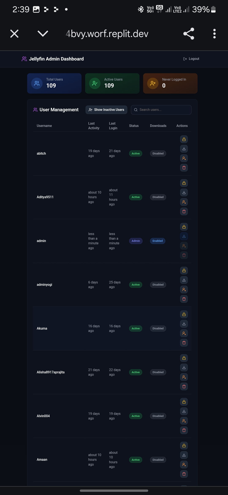

# Jellyfin Signup Application

A modern web application that allows users to create accounts for your Jellyfin media server. This user-friendly signup tool integrates directly with your Jellyfin server API to create and manage user accounts.

[![Jellyfin][jellyfin-shield]][jellyfin-url]
[![Docker][docker-shield]][docker-url]
[![SEO Optimized][seo-shield]][seo-url]
[![Deploy with Vercel][vercel-shield]][vercel-deploy-url]

[jellyfin-shield]: https://img.shields.io/badge/media%20server-jellyfin-00a4dc?style=for-the-badge&logo=jellyfin&logoColor=white
[jellyfin-url]: https://jellyfin.org/
[docker-shield]: https://img.shields.io/badge/container-docker-2496ED?style=for-the-badge&logo=docker&logoColor=white
[docker-url]: https://www.docker.com/
[seo-shield]: https://img.shields.io/badge/SEO-Optimized-brightgreen?style=for-the-badge
[seo-url]: #
[vercel-shield]: https://img.shields.io/badge/deploy%20with-vercel-black?style=for-the-badge&logo=vercel&logoColor=white
[vercel-deploy-url]: https://vercel.com/new/clone?repository-url=https%3A%2F%2Fgithub.com%2Fyourusername%2Fjellyfin-signup-app&env=JELLYFIN_API_KEY,JELLYFIN_SERVER_URL,TMDB_API_KEY&project-name=jellyfin-signup&repository-name=jellyfin-signup

## Features

- **Easy Account Creation**: User-friendly signup form with username and password fields
- **Security**: Password strength indicator ensures users create secure passwords
- **Modern Design**: Beautiful UI with responsive design for all devices
- **Direct Integration**: Connects directly to your Jellyfin server API without additional configuration
- **Content Management**: Disables downloads for new users automatically to protect your media
- **Admin Control**: Admin dashboard for user management with automatic admin authentication
- **Dynamic Background**: Shows trending movies and TV shows in the background (customizable for Indian content)
- **Multilingual Support**: Works across languages and regions
- **Docker Ready**: Easy deployment with Docker and Portainer on your VPS

## Screenshots

### Signup Page


### Admin Login


### Admin Dashboard


## One-Click Deployment with Vercel

Click the "Deploy with Vercel" button at the top of this README to instantly deploy your Jellyfin Signup application to Vercel's global CDN.

### Vercel Deployment Steps

1. Click the "Deploy with Vercel" button
2. Connect your GitHub account and select where to import the repository
3. Configure the required environment variables:
   - `JELLYFIN_API_KEY`: Your Jellyfin API key
   - `JELLYFIN_SERVER_URL`: Your Jellyfin server URL (e.g., https://jellyfin.yourdomain.com)
   - `TMDB_API_KEY`: Your TMDB API key for movie backgrounds
4. Click "Deploy" and wait for the build to complete
5. Your application will be instantly available at a Vercel-provided URL

## Deployment Instructions for VPS with Portainer

### Prerequisites

- Docker and Docker Compose installed on your VPS
- Portainer set up and running
- Your Jellyfin server running (either on the same VPS or accessible via network)

### Step 1: Prepare the Environment File

1. Create a `.env` file based on the example:
   ```
   JELLYFIN_API_KEY=your_jellyfin_api_key_here
   JELLYFIN_SERVER_URL=your_jellyfin_server_url_here
   TMDB_API_KEY=your_tmdb_api_key_here
   SESSION_SECRET=auto_generated_if_not_provided
   ```

2. Replace the values with your actual Jellyfin API key and server URL.

3. For TMDB_API_KEY, get a free API key from [The Movie Database](https://www.themoviedb.org/settings/api) to enable the background movie posters.

4. The SESSION_SECRET will be auto-generated if not provided, but for production you can generate a secure random string with:
   ```bash
   # Run this command to generate a secure SESSION_SECRET
   node -e "console.log(require('crypto').randomBytes(32).toString('hex'))"
   ```

### Step 2: Deploy with Portainer

#### Option 1: Using the Docker Compose Stack

1. In Portainer, go to "Stacks" and click "Add stack"
2. Give it a name like "jellyfin-signup"
3. In the "Web editor" tab, paste the content of your `docker-compose.yml` file
4. Click "Deploy the stack"

#### Option 2: Using Docker Compose CLI

If you prefer using the command line:

1. Upload the entire project to your VPS (using SCP, SFTP, or Git)
2. Navigate to the project directory
3. Run `docker-compose up -d`

### Step 3: Configure Network (if needed)

If your Jellyfin server is running in a different Docker network:

1. Edit the `docker-compose.yml` file 
2. Uncomment the "external" network configuration
3. Set the name to match your existing Jellyfin network

### Step 4: Access the Application

Once deployed, your signup page will be available at:

```
http://your-vps-ip:5000
```

You may want to set up a reverse proxy (like Nginx or Traefik) to provide SSL 
and a custom domain name.

## Maintenance

- View logs: `docker logs jellyfin-signup`
- Restart: `docker restart jellyfin-signup`
- Update: Pull the latest code and rebuild with `docker-compose up -d --build`

## Environment Variables

- `JELLYFIN_API_KEY`: Your Jellyfin API key for authentication
- `JELLYFIN_SERVER_URL`: The URL of your Jellyfin server
- `TMDB_API_KEY`: Your TMDB API key for fetching movie backgrounds and posters
- `SESSION_SECRET`: Secret key for securing sessions (auto-generated if not provided)

## Keywords and Search Terms

- jellyfin signup app
- jellyfin registration form
- jellyfin account creation
- jellyfin user management
- create jellyfin account
- jellyfin media server account
- jellyfin open source signup
- media server account creation
- jellyfin admin dashboard
- plex emby alternative signup
- media server user management
- self-hosted media server account

## Support

If you need assistance with this application, please open an issue on the repository or contact the maintainer.